# PauliBot — Use Case Diagram & Use Case Specifications

---

## Part 1: Use Case Diagram

### Notation Guide
- **Stick Figure**: Actor (User or External System)
- **Oval/Stadium**: Use Case (Process/Event)
- **Solid Line** (`──`): Association (Direct relationship)
- **Dashed Arrow** (`.->`): Includes `<<include>>` or Extends `<<extend>>`

### System Diagram

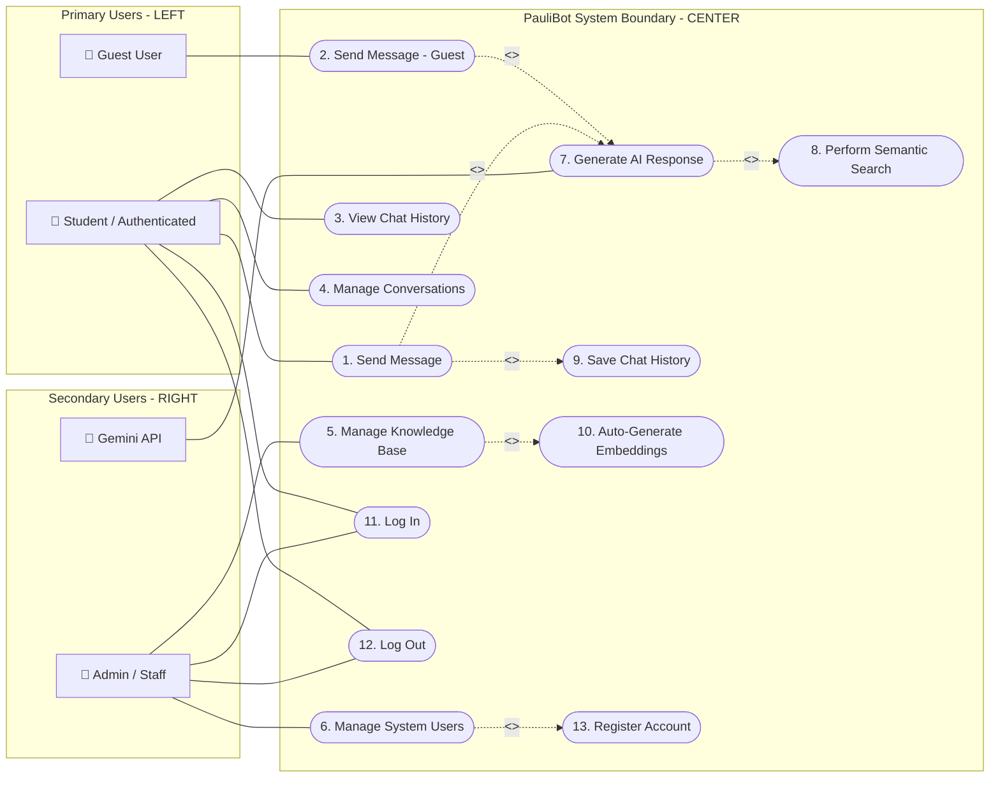

---

## Part 2: Use Case Specifications (Exact 1-to-1 Mapping)

---

### UC-01: Send Message

| Field | Details |
|---|---|
| **Use Case Name** | 1. Send Message |
| **Actors** | Student (Primary) |
| **Brief Description** | An authenticated student sends a prompt/question to PauliBot to receive an intelligent answer. |
| **Precondition(s)** | Student is logged into the system and Chat interface is loaded. |
| **Postcondition(s)** | AI response is generated and displayed to the user. |
| **Business Rule** | Empty messages are rejected. |

#### Main Flow / Basic Path

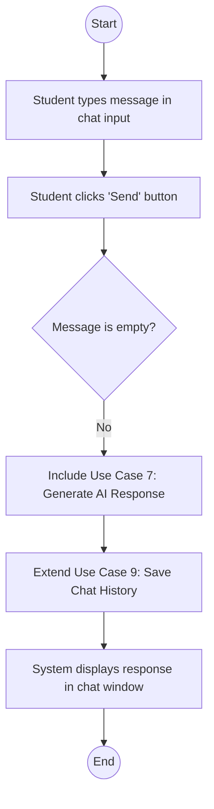

#### Alternative Flow 

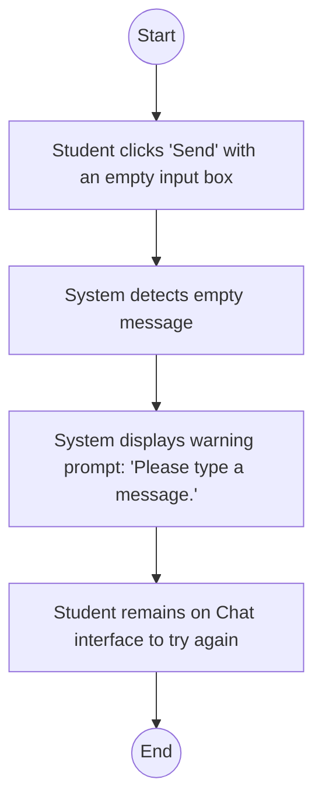

---

### UC-02: Send Message - Guest

| Field | Details |
|---|---|
| **Use Case Name** | 2. Send Message - Guest |
| **Actors** | Guest User (Primary) |
| **Brief Description** | A guest user submits a question to PauliBot without logging in. Conversations are active but transient. |
| **Precondition(s)** | Guest has accepted terms and is viewing the Chat window. |
| **Postcondition(s)** | Response is displayed. Data is **not** saved. |
| **Business Rule** | Guest sessions are transient (no history preserved). |

#### Main Flow / Basic Path

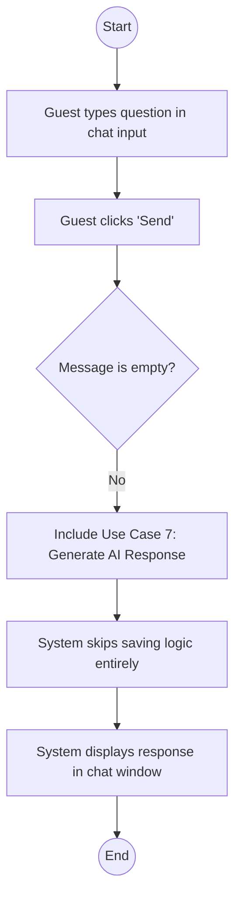

#### Alternative Flow

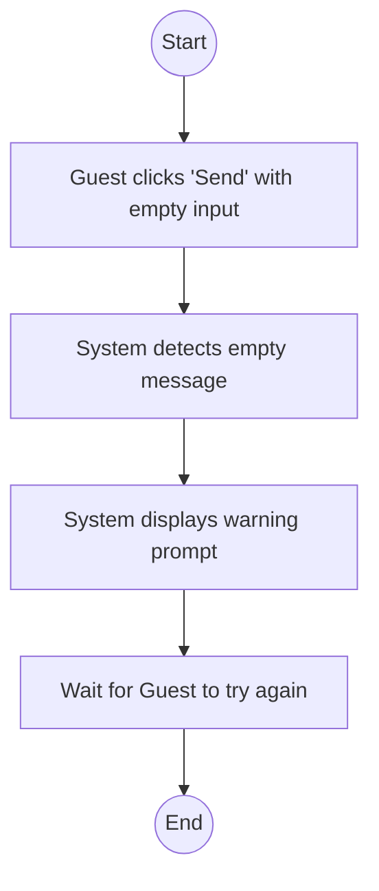

---

### UC-03: View Chat History

| Field | Details |
|---|---|
| **Use Case Name** | 3. View Chat History |
| **Actors** | Student (Primary) |
| **Brief Description** | Allows a student to browse and load previous conversations from the sidebar. |
| **Precondition(s)** | Student is logged in. |
| **Postcondition(s)** | Selected conversation messages populate the main chat area. |
| **Business Rule** | Students can only access their own conversation history. |

#### Main Flow / Basic Path

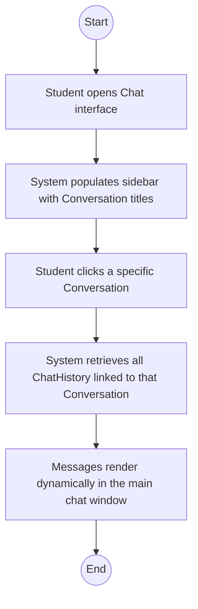

#### Alternative Flow

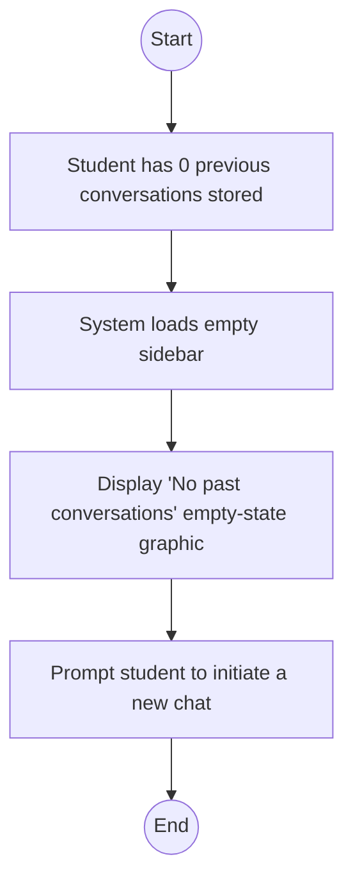

---

### UC-04: Manage Conversations

| Field | Details |
|---|---|
| **Use Case Name** | 4. Manage Conversations |
| **Actors** | Student (Primary) |
| **Brief Description** | A student creates a new conversation thread or deletes an existing thread. |
| **Precondition(s)** | Student is authenticated and viewing the chat. |
| **Postcondition(s)** | Sidebar list is updated; deleted conversations are permanently removed. |
| **Business Rule** | Deleting a conversation triggers a CASCADE delete for all messages inside. |

#### Main Flow / Basic Path

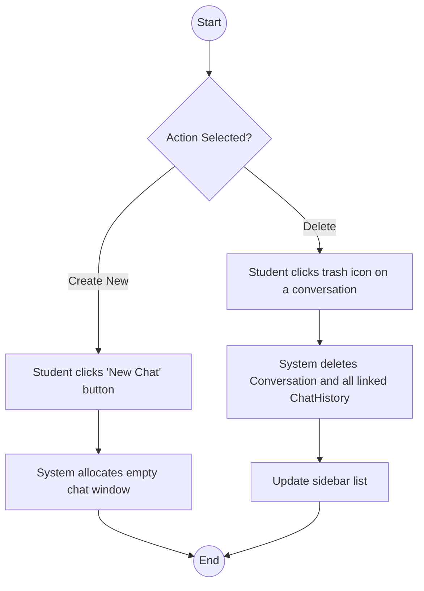

#### Alternative Flow

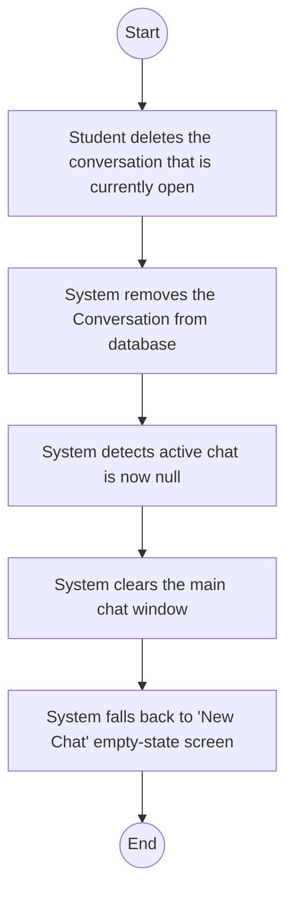

---

### UC-05: Manage Knowledge Base

| Field | Details |
|---|---|
| **Use Case Name** | 5. Manage Knowledge Base |
| **Actors** | Admin / Staff (Secondary) |
| **Brief Description** | Admin creates, reads, updates, or deletes (CRUD) FAQs, Locations, and Staff records. |
| **Precondition(s)** | Admin logged into Django dashboard with `is_staff=True`. |
| **Postcondition(s)** | Knowledge records updated in the database. |
| **Business Rule** | Modifications to the text must trigger an embedding recalculation. |

#### Main Flow / Basic Path

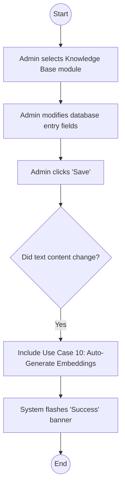

#### Alternative Flow

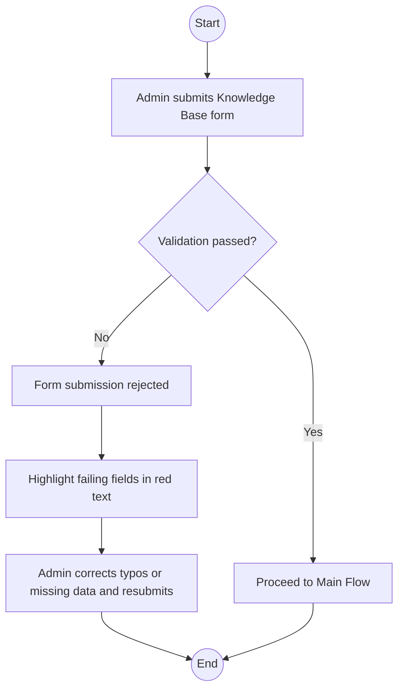

---

### UC-06: Manage System Users

| Field | Details |
|---|---|
| **Use Case Name** | 6. Manage System Users |
| **Actors** | Admin (Secondary) |
| **Brief Description** | Admin controls student accounts by deactivating abusive users or creating manual accounts. |
| **Precondition(s)** | Admin logged in with superuser permissions (`is_superuser=True`). |
| **Postcondition(s)** | Target student account is updated/restricted. |
| **Business Rule** | Admins cannot view plaintext passwords. |

#### Main Flow / Basic Path

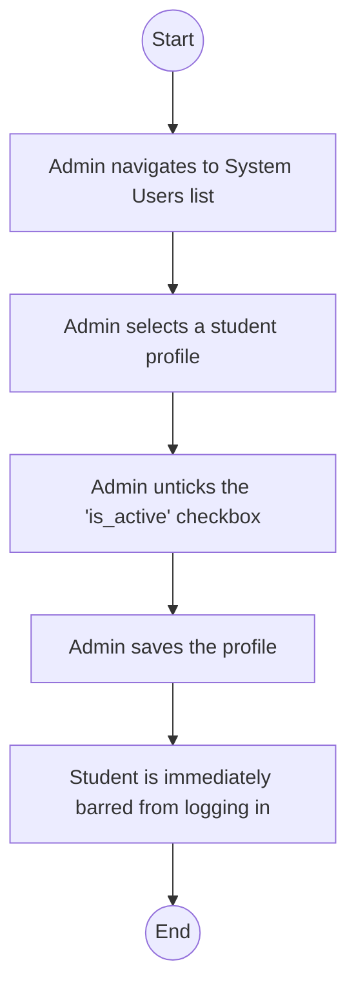

#### Alternative Flow

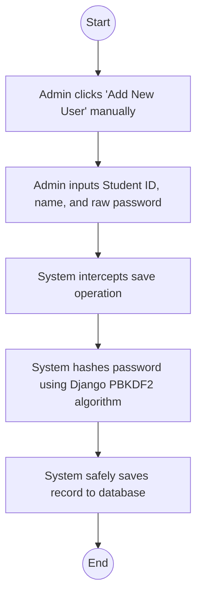

---

### UC-07: Generate AI Response

| Field | Details |
|---|---|
| **Use Case Name** | 7. Generate AI Response |
| **Actors** | Gemini API (Secondary) |
| **Brief Description** | (Sub-Process). Constructs an strict AI prompt using verified context and fetches the generation from Google Gemini. |
| **Precondition(s)** | Triggered by *Send Message* or *Send Message - Guest*. |
| **Postcondition(s)** | Yields a formulated string response. |
| **Business Rule** | API calls must be wrapped in error-handling logic (try/catch). |

#### Main Flow / Basic Path

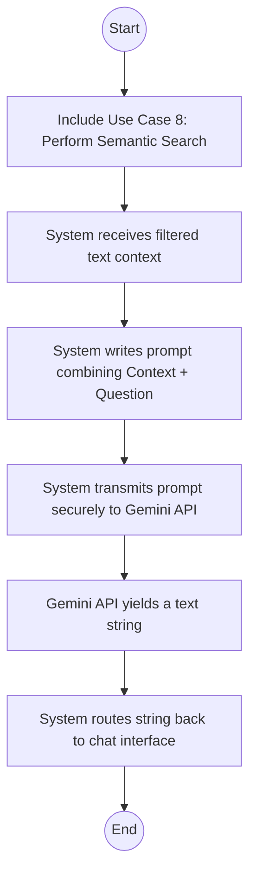

#### Alternative Flow

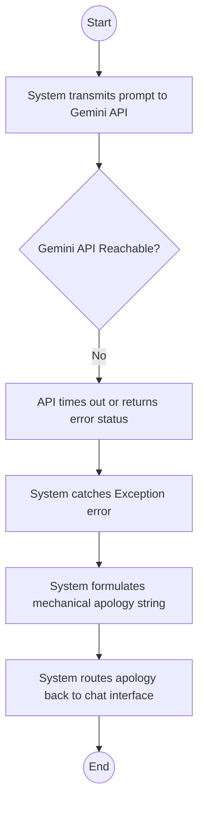

---

### UC-08: Perform Semantic Search

| Field | Details |
|---|---|
| **Use Case Name** | 8. Perform Semantic Search |
| **Actors** | System (Implicit Backend) |
| **Brief Description** | (Sub-Process). Vectorizes the query and compares it against the Knowledge Base using pgvector distance. |
| **Precondition(s)** | Triggered by *Generate AI Response*. |
| **Postcondition(s)** | Returns top 3 most relevant textual DB entries. |
| **Business Rule** | Relies on the `all-MiniLM-L6-v2` embedding logic. |

#### Main Flow / Basic Path

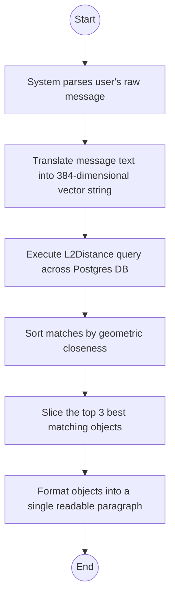

#### Alternative Flow

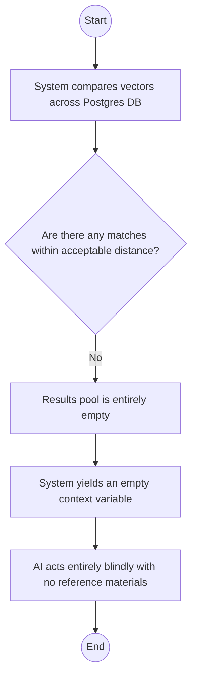

---

### UC-09: Save Chat History

| Field | Details |
|---|---|
| **Use Case Name** | 9. Save Chat History |
| **Actors** | System (Implicit Backend) |
| **Brief Description** | (Sub-Process). Persists chat logs so they can be reviewed by the student later. |
| **Precondition(s)** | Triggered selectively by *Send Message (Authenticated)* via `<<extend>>`. |
| **Postcondition(s)** | ChatHistory tables are updated. |
| **Business Rule** | Messages can only be saved if a linked Conversation thread exists. |

#### Main Flow / Basic Path

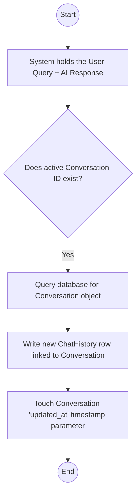

#### Alternative Flow

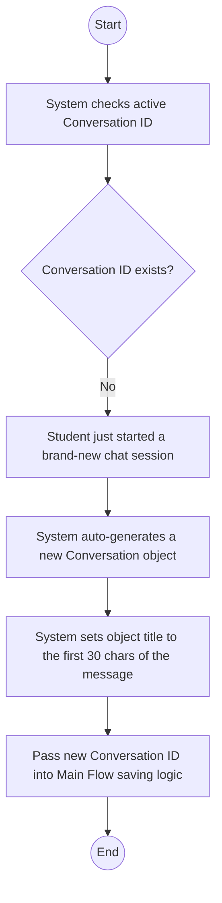

---

### UC-10: Auto-Generate Embeddings

| Field | Details |
|---|---|
| **Use Case Name** | 10. Auto-Generate Embeddings |
| **Actors** | System (Implicit Backend) |
| **Brief Description** | (Sub-Process). Generates the AI mathematical vectors whenever Admin modifies knowledge resources. |
| **Precondition(s)** | Triggered heavily by *Manage Knowledge Base* saving. |
| **Postcondition(s)** | PGVector fields populated successfully. |
| **Business Rule** | To save computer power, generation is lazy (calculated only when searched/saved with diffs). |

#### Main Flow / Basic Path

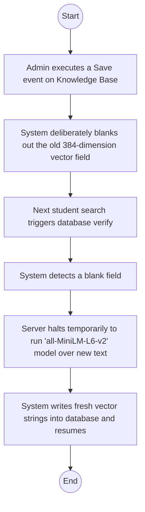

#### Alternative Flow

```mermaid
flowchart TD
    A((Start)) --> B[Admin executes a Save event on Knowledge Base]
    B --> C[System compares old text to newly submitted text]
    C --> D{Is the text strictly identical?}
    D -- Yes --> E[Admin only clicked Save without actually editing]
    E --> F[System skips blanking the vector field to conserve server power]
    F --> G((End))
```

---

### UC-11: Log In

| Field | Details |
|---|---|
| **Use Case Name** | 11. Log In |
| **Actors** | Student, Admin (Primary) |
| **Brief Description** | Users authenticate to access protected features (Chat History for Students, Dashboard for Admins). |
| **Precondition(s)** | User is on the Landing Page. |
| **Postcondition(s)** | User session is established; user is redirected to the appropriate interface. |
| **Business Rule** | Students use Student ID; Admins use Username. Password hashing is mandatory. |

#### Main Flow / Basic Path

```mermaid
flowchart TD
    A((Start)) --> B[User enters credentials]
    B --> C[User clicks 'Login']
    C --> D{Credentials valid?}
    D -- Yes --> E[System establishes session]
    E --> F[Redirect to Home/Chat]
    F --> G((End))
    D -- No --> H[Proceed to Alternative Flow]
    H --> G
```

#### Alternative Flow / Invalid Credentials

```mermaid
flowchart TD
    A((Start)) --> B[System detects invalid Student ID or Password]
    B --> C[System displays 'Invalid Student ID or password' error message]
    C --> D[User remains on Landing Page to retry]
    D --> E((End))
```

---

### UC-12: Log Out

| Field | Details |
|---|---|
| **Use Case Name** | 12. Log Out |
| **Actors** | Student, Admin (Primary) |
| **Brief Description** | Terminating the active session to prevent unauthorized access. |
| **Precondition(s)** | User is authenticated. |
| **Postcondition(s)** | Session is destroyed; user is redirected to Landing Page. |
| **Business Rule** | Session cookies must be cleared. |

#### Main Flow / Basic Path

```mermaid
flowchart TD
    A((Start)) --> B[User clicks 'Logout' button]
    B --> C[System terminates session]
    C --> D[System redirects to Landing Page]
    D --> E((End))
```

#### Alternative Flow / Expired Session

```mermaid
flowchart TD
    A((Start)) --> B[User session has already expired or timed out]
    B --> C[User clicks Logout or any protected link]
    C --> D[System detects null or expired session token]
    D --> E[System auto-redirects to Landing Page]
    E --> F((End))
```

---

### UC-13: Register Account

| Field | Details |
|---|---|
| **Use Case Name** | 13. Register Account |
| **Actors** | Admin (Primary) |
| **Brief Description** | (Sub-Process). Admin creates a new student account in the system. |
| **Precondition(s)** | Triggered by *Manage System Users* (UC-06). |
| **Postcondition(s)** | New CustomUser record created in database. |
| **Business Rule** | Student ID must be unique. Passwords must be hashed. |

#### Main Flow / Basic Path

```mermaid
flowchart TD
    A((Start)) --> B[Admin enters Student ID and Name]
    B --> C[Admin sets initial password]
    C --> D[System validates uniqueness of Student ID]
    D --> E[System hashes password and saves User]
    E --> F[Display success message]
    F --> G((End))
```

#### Alternative Flow / Validation Error

```mermaid
flowchart TD
    A((Start)) --> B[System detects Student ID already exists or invalid data]
    B --> C[System rejects save operation]
    C --> D[System highlights data errors on form]
    D --> E[Admin corrects the data to retry]
    E --> F((End))
```

---

## F. Proposed System Description

### 1. System Architecture
The PauliBot employs a modern, three-tier architecture designed for scalability, security, and high-performance AI inference.

```mermaid
graph TD
    subgraph Users ["Users"]
        Student_U["웃 Student"]
        Guest_U["웃 Guest"]
        Admin_U["웃 Admin"]
    end

    subgraph Client ["Presentation Layer (Front-end)"]
        UI["🌐 Web Browser<br/>(HTML / CSS / JS)"]
    end

    subgraph Server ["Logic Layer (Back-end)"]
        Django["🐍 Django Framework"]
        Logic["🧠 PauliBot Logic Engine"]
        RAG["🔍 RAG Searcher<br/>(SentenceTransformer)"]
    end

    subgraph AI ["External Services"]
        Gemini["🤖 Google Gemini API<br/>(Flash 2.5 Model)"]
    end

    subgraph DB ["Data Layer (Database)"]
        Postgres[("🐘 PostgreSQL + pgvector<br/>(Relational & Vector Data)")]
    end

    %% Flow of Data
    Users ==> UI
    UI <== HTTP ==> Django
    Django <==> Logic
    Logic <==> RAG
    RAG <==> Postgres
    Logic <== API Requests ==> Gemini
```

#### Front-end (Presentation Layer)
-   **Technology**: HTML (via Django Templates), Vanilla CSS, and JavaScript.
-   **Description**: A responsive web interface that provides a seamless chat experience. It handles user authentication (Student ID login), manages active conversation threads, and renders AI responses in real-time. The design prioritizes accessibility and ease of use for both desktop and mobile users.

#### Back-end (Logic Layer)
-   **Technology**: Python / Django Framework.
-   **Core Components**:
    -   **PauliBot Logic Engine**: Orchestrates communication between the UI, the semantic searcher, and the Gemini API.
    -   **RAG Searcher**: Utilizes the `SentenceTransformer` model (`all-MiniLM-L6-v2`) to convert queries into vectors.
    -   **Gemini API Integration**: Leverages Google’s Flash 2.5 model to synthesize responses based on retrieved context.

#### Database (Data Layer)
-   **Technology**: PostgreSQL with **pgvector** extension.
-   **Storage**: 
    -   **Relational Data**: Stores user profiles, chat history, and admin settings.
    -   **Vector Data**: Stores high-dimensional embeddings for the Knowledge Base (FAQs, Locations, Staff details), enabling semantic search.

### 2. How the New System Solves the Identified Problems

| Identified Problem | PauliBot Solution |
| :--- | :--- |
| **Information Overload** | Provides instant, direct answers instead of requiring students to manually search through handbooks. |
| **Staff Unavailability** | Available 24/7, ensuring inquiries are answered even outside office hours. |
| **Outdated/Inaccurate Data** | Admin Dashboard allows for real-time updates to the Knowledge Base, making the AI immediately aware of changes. |
| **Keyword Limitations** | Semantic search understands user intent and synonyms, rather than relying on exact word matches. |
| **AI Hallucinations** | Uses Retrieval-Augmented Generation (RAG) to ground AI responses strictly in verified university data. |

---

## Requirements

### 1. Functional Requirements (FR)
-   **FR1: User Authentication**: The system shall allow students to log in using their Student ID and administrators using their username.
-   **FR2: Intelligent Chatbot Interface**: The system shall provide a chat interface where users can ask questions in natural language.
-   **FR3: Knowledge Retrieval (RAG)**: The system shall retrieve relevant information from the Knowledge Base based on semantic similarity to the user's query.
-   **FR4: AI Response Generation**: The system shall generate natural-sounding responses using the Google Gemini API, grounded in retrieved context.
-   **FR5: Administrative Dashboard**: The system shall provide a dashboard for administrators to manage Knowledge Base entries (FAQs, Staff, Locations).
-   **FR6: Chat History Management**: The system shall store and display previous chat conversations for authenticated students.

### 2. Non-Functional Requirements (NFR)
-   **NFR1: Performance**: The system shall return a response to user queries within 3-5 seconds under normal network conditions.
-   **NFR2: Accuracy**: The system shall prioritize factual accuracy by strictly utilizing the Knowledge Base context for its responses.
-   **NFR3: Scalability**: The system shall support concurrent user sessions by utilizing a robust PostgreSQL backend.
-   **NFR4: Security**: The system shall secure sensitive data, including password hashing and environment variable protection for API keys.
-   **NFR5: Availability**: The system shall be accessible 24/7 via a web browser.
