# PauliBot — Use Case Diagram & Use Case Specifications

---

## Part 1: Use Case Diagram

### Notation Guide
- **Stick Figure**: Actor (User or External System)
- **Oval/Stadium**: Use Case (Process/Event)
- **Solid Line** (`──`): Association (Direct relationship)
- **Dashed Arrow** (`.->`): Includes `<<include>>` or Extends `<<extend>>`

### System Diagram

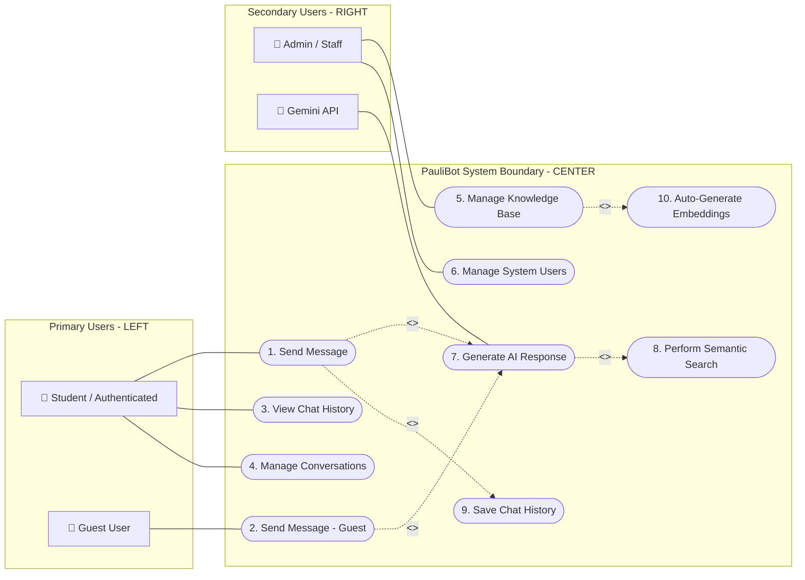

---

## Part 2: Use Case Specifications (Exact 1-to-1 Mapping)

---

### UC-01: Send Message

| Field | Details |
|---|---|
| **Use Case Name** | 1. Send Message |
| **Actors** | Student (Primary) |
| **Brief Description** | An authenticated student sends a prompt/question to PauliBot to receive an intelligent answer. |
| **Precondition(s)** | Student is logged into the system and Chat interface is loaded. |
| **Postcondition(s)** | AI response is generated and displayed to the user. |
| **Business Rule** | Empty messages are rejected. |

#### Main Flow / Basic Path

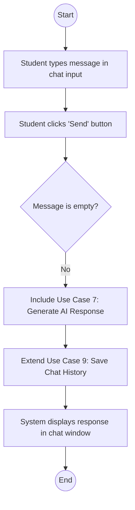

#### Alternative Flow 

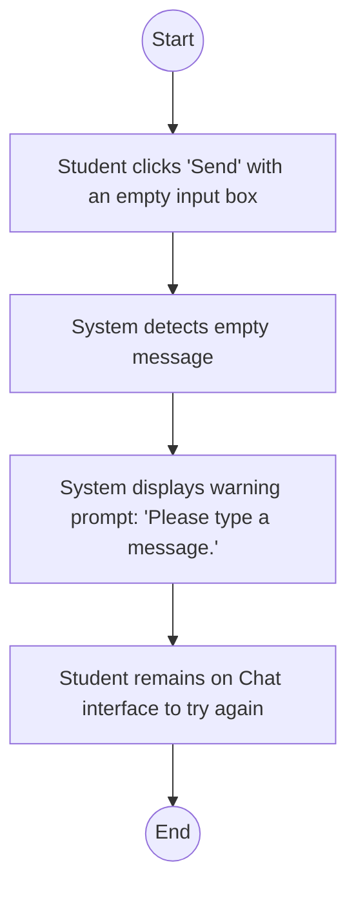

---

### UC-02: Send Message - Guest

| Field | Details |
|---|---|
| **Use Case Name** | 2. Send Message - Guest |
| **Actors** | Guest User (Primary) |
| **Brief Description** | A guest user submits a question to PauliBot without logging in. Conversations are active but transient. |
| **Precondition(s)** | Guest has accepted terms and is viewing the Chat window. |
| **Postcondition(s)** | Response is displayed. Data is **not** saved. |
| **Business Rule** | Guest sessions are transient (no history preserved). |

#### Main Flow / Basic Path

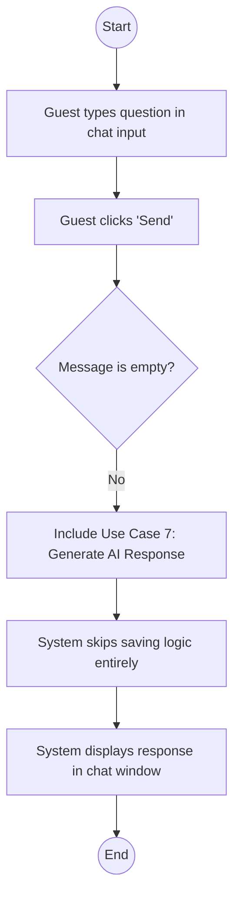

#### Alternative Flow

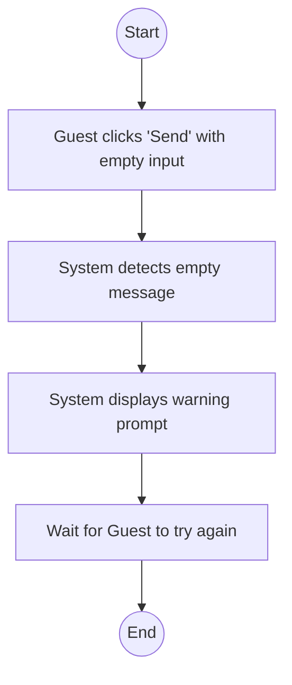

---

### UC-03: View Chat History

| Field | Details |
|---|---|
| **Use Case Name** | 3. View Chat History |
| **Actors** | Student (Primary) |
| **Brief Description** | Allows a student to browse and load previous conversations from the sidebar. |
| **Precondition(s)** | Student is logged in. |
| **Postcondition(s)** | Selected conversation messages populate the main chat area. |
| **Business Rule** | Students can only access their own conversation history. |

#### Main Flow / Basic Path

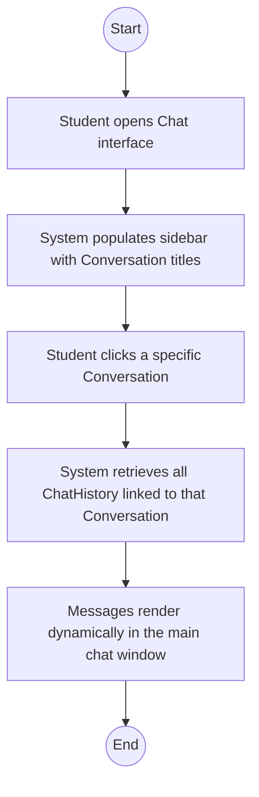

#### Alternative Flow

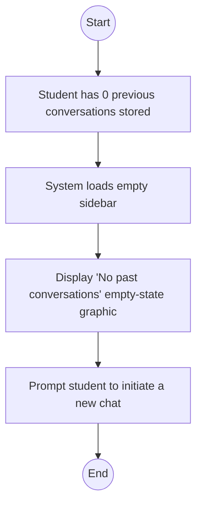

---

### UC-04: Manage Conversations

| Field | Details |
|---|---|
| **Use Case Name** | 4. Manage Conversations |
| **Actors** | Student (Primary) |
| **Brief Description** | A student creates a new conversation thread or deletes an existing thread. |
| **Precondition(s)** | Student is authenticated and viewing the chat. |
| **Postcondition(s)** | Sidebar list is updated; deleted conversations are permanently removed. |
| **Business Rule** | Deleting a conversation triggers a CASCADE delete for all messages inside. |

#### Main Flow / Basic Path

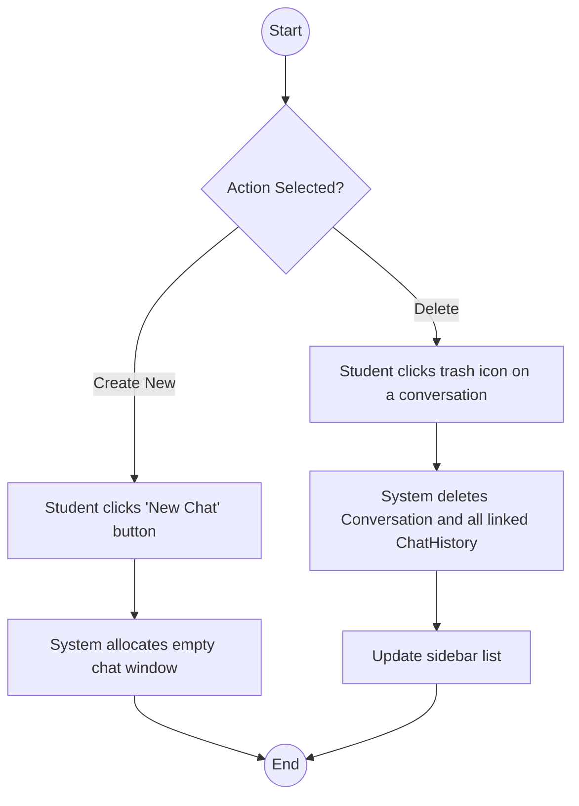

#### Alternative Flow

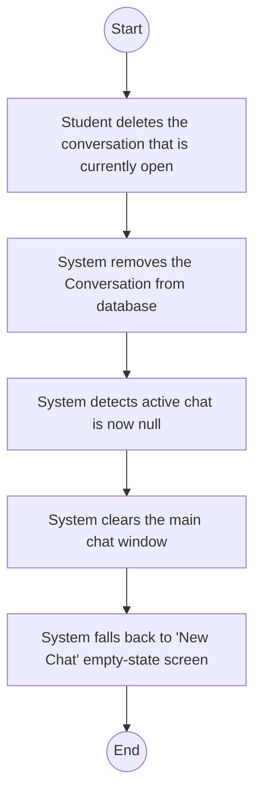

---

### UC-05: Manage Knowledge Base

| Field | Details |
|---|---|
| **Use Case Name** | 5. Manage Knowledge Base |
| **Actors** | Admin / Staff (Secondary) |
| **Brief Description** | Admin creates, reads, updates, or deletes (CRUD) FAQs, Locations, and Staff records. |
| **Precondition(s)** | Admin logged into Django dashboard with `is_staff=True`. |
| **Postcondition(s)** | Knowledge records updated in the database. |
| **Business Rule** | Modifications to the text must trigger an embedding recalculation. |

#### Main Flow / Basic Path

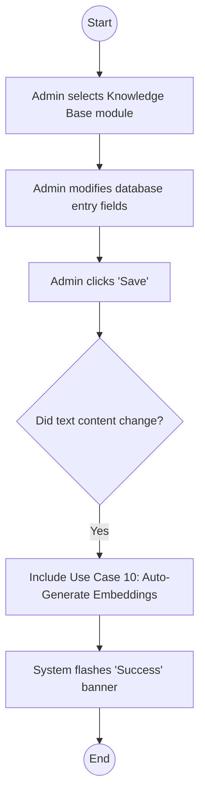

#### Alternative Flow

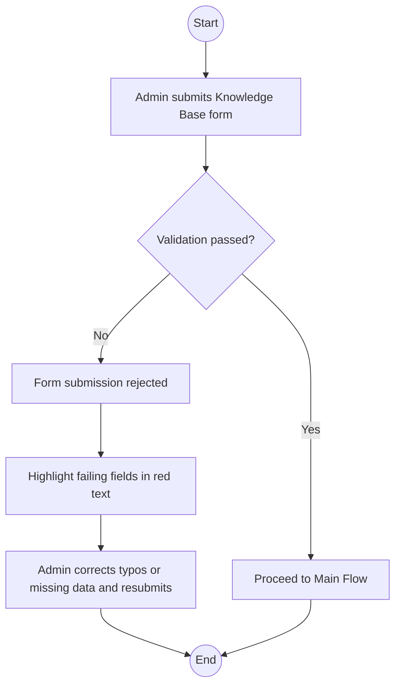

---

### UC-06: Manage System Users

| Field | Details |
|---|---|
| **Use Case Name** | 6. Manage System Users |
| **Actors** | Admin (Secondary) |
| **Brief Description** | Admin controls student accounts by deactivating abusive users or creating manual accounts. |
| **Precondition(s)** | Admin logged in with superuser permissions (`is_superuser=True`). |
| **Postcondition(s)** | Target student account is updated/restricted. |
| **Business Rule** | Admins cannot view plaintext passwords. |

#### Main Flow / Basic Path

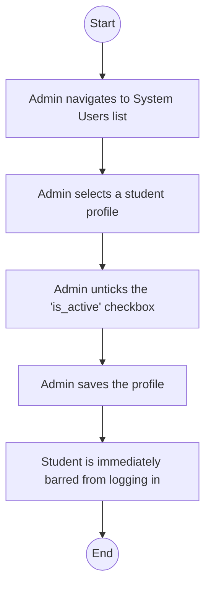

#### Alternative Flow

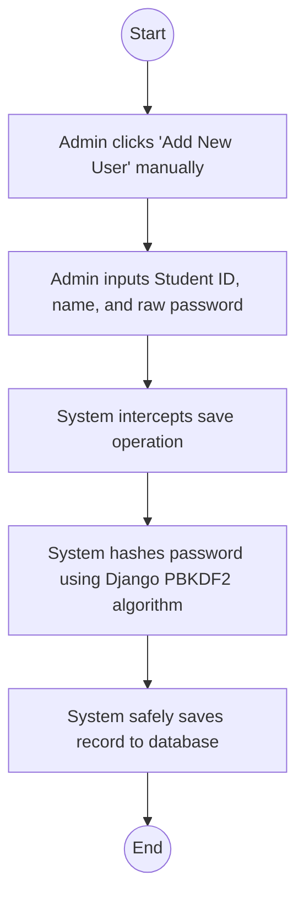

---

### UC-07: Generate AI Response

| Field | Details |
|---|---|
| **Use Case Name** | 7. Generate AI Response |
| **Actors** | Gemini API (Secondary) |
| **Brief Description** | (Sub-Process). Constructs an strict AI prompt using verified context and fetches the generation from Google Gemini. |
| **Precondition(s)** | Triggered by *Send Message* or *Send Message - Guest*. |
| **Postcondition(s)** | Yields a formulated string response. |
| **Business Rule** | API calls must be wrapped in error-handling logic (try/catch). |

#### Main Flow / Basic Path

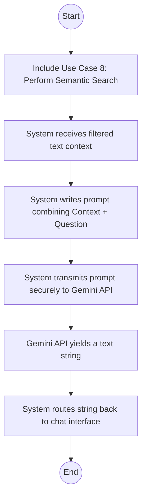

#### Alternative Flow

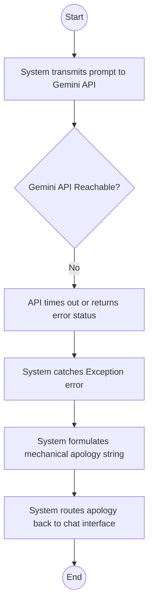

---

### UC-08: Perform Semantic Search

| Field | Details |
|---|---|
| **Use Case Name** | 8. Perform Semantic Search |
| **Actors** | System (Implicit Backend) |
| **Brief Description** | (Sub-Process). Vectorizes the query and compares it against the Knowledge Base using pgvector distance. |
| **Precondition(s)** | Triggered by *Generate AI Response*. |
| **Postcondition(s)** | Returns top 3 most relevant textual DB entries. |
| **Business Rule** | Relies on the `all-MiniLM-L6-v2` embedding logic. |

#### Main Flow / Basic Path

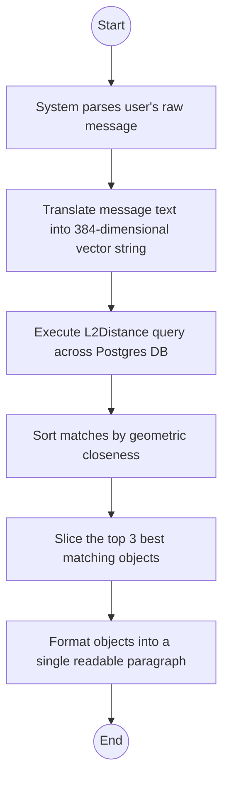

#### Alternative Flow

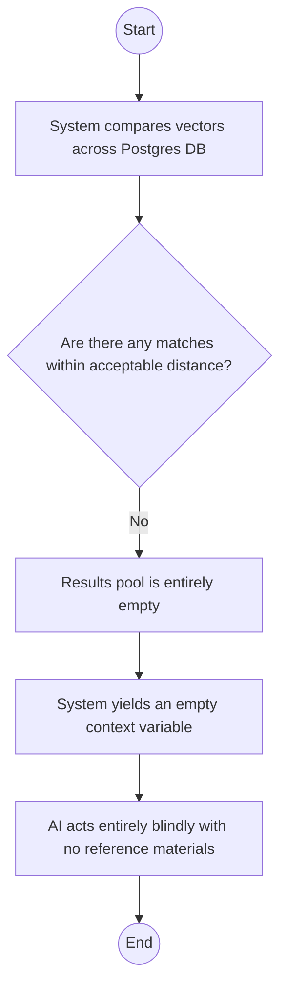

---

### UC-09: Save Chat History

| Field | Details |
|---|---|
| **Use Case Name** | 9. Save Chat History |
| **Actors** | System (Implicit Backend) |
| **Brief Description** | (Sub-Process). Persists chat logs so they can be reviewed by the student later. |
| **Precondition(s)** | Triggered selectively by *Send Message (Authenticated)* via `<<extend>>`. |
| **Postcondition(s)** | ChatHistory tables are updated. |
| **Business Rule** | Messages can only be saved if a linked Conversation thread exists. |

#### Main Flow / Basic Path

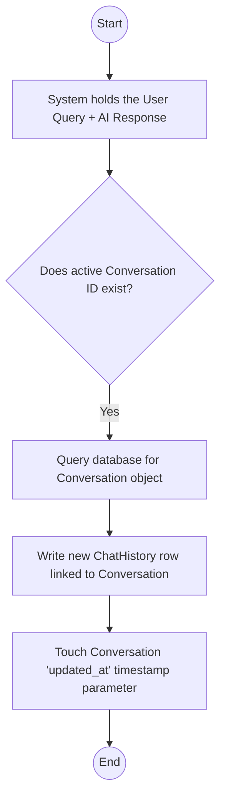

#### Alternative Flow

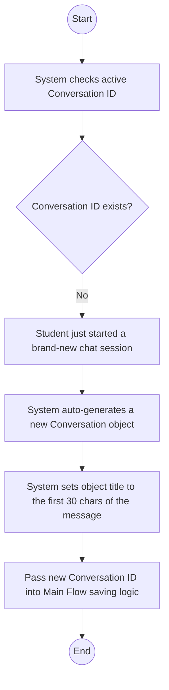

---

### UC-10: Auto-Generate Embeddings

| Field | Details |
|---|---|
| **Use Case Name** | 10. Auto-Generate Embeddings |
| **Actors** | System (Implicit Backend) |
| **Brief Description** | (Sub-Process). Generates the AI mathematical vectors whenever Admin modifies knowledge resources. |
| **Precondition(s)** | Triggered heavily by *Manage Knowledge Base* saving. |
| **Postcondition(s)** | PGVector fields populated successfully. |
| **Business Rule** | To save computer power, generation is lazy (calculated only when searched/saved with diffs). |

#### Main Flow / Basic Path

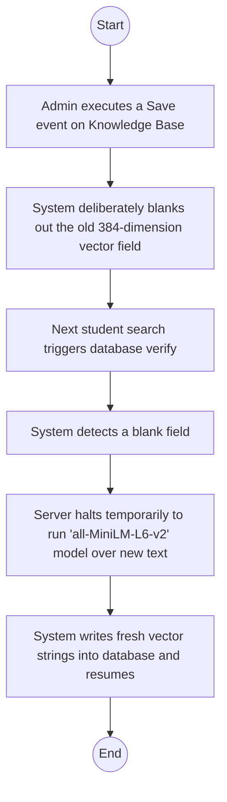

#### Alternative Flow

```mermaid
flowchart TD
    A((Start)) --> B[Admin executes a Save event on Knowledge Base]
    B --> C[System compares old text to newly submitted text]
    C --> D{Is the text strictly identical?}
    D -- Yes --> E[Admin only clicked Save without actually editing]
    E --> F[System skips blanking the vector field to conserve server power]
    F --> G((End))
```
